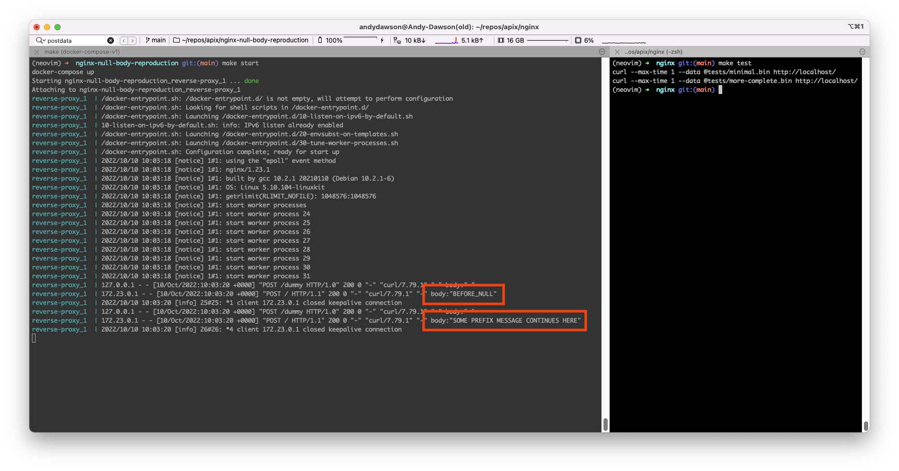

`$request_body` variable malformed if body contains a NUL character
=======

This is a minimal reproduction of a problem we're observering where the
`$request_body` variable is incomplete if the request body contains NUL/control
characters. To reproduce:

1) `make start` in one terminal
1) `make test` in another terminal
1) look at the log output in the terminal

Minimal test case
---

The first test file contains:

  BEFORE_NULL\x00AFTER_NULL

But the log output contains:

> reverse-proxy_1  | 172.23.0.1 - - [10/Oct/2022:09:15:27 +0000] "POST / HTTP/1.1" 200 0 "-" "curl/7.79.1" "-" body:"BEFORE_NULL"

Note the logged body does not contain `AFTER_NULL`

More complete test case
---

This test file contains:

  SOME_PREFIX\x00... some more content ...MESSAGE CONTINUES HERE

But the log output contains:

> reverse-proxy_1  | 172.23.0.1 - - [10/Oct/2022:09:15:27 +0000] "POST / HTTP/1.1" 200 0 "-" "curl/7.79.1" "-" body:"SOME PREFIX MESSAGE CONTINUES HERE"

Note the logged body is missing everything between `SOME_PREFIX` and `MESSAGE
CONTINUES HERE`

Further context
---

In case relevant - the actual use case here is in nginx used as a reverse proxy
we are attempting to detect literal strings (such as `LOOKING_FOR_THIS_STRING`
in the more-complete.bin example) in application/msbin1 SOAP post bodies, whilst
this is a binary format the strings we are looking for are present in the post
body and would be possible to detect if the variable `$request_body` contained
the whole post body.
